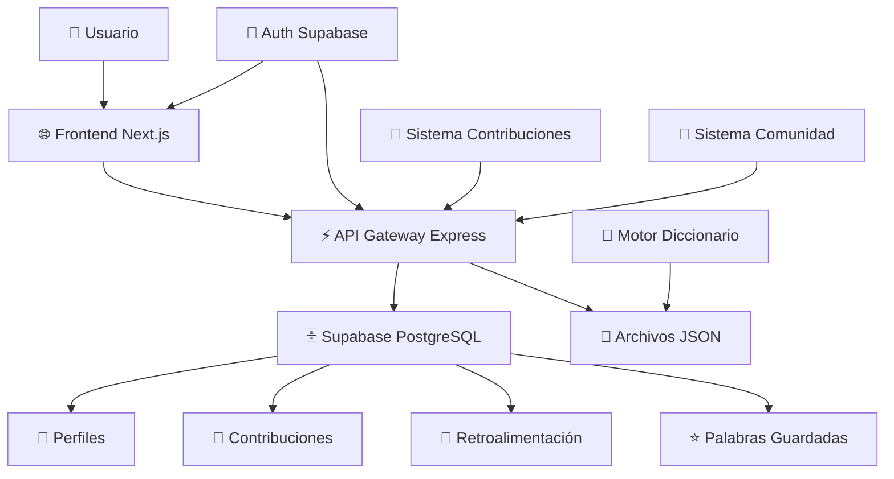
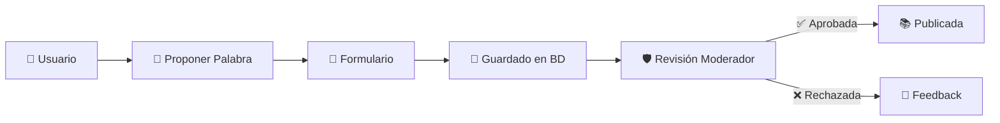
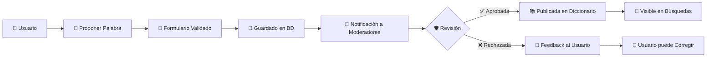
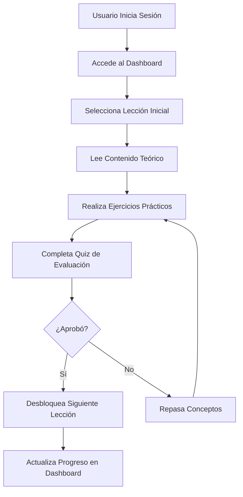
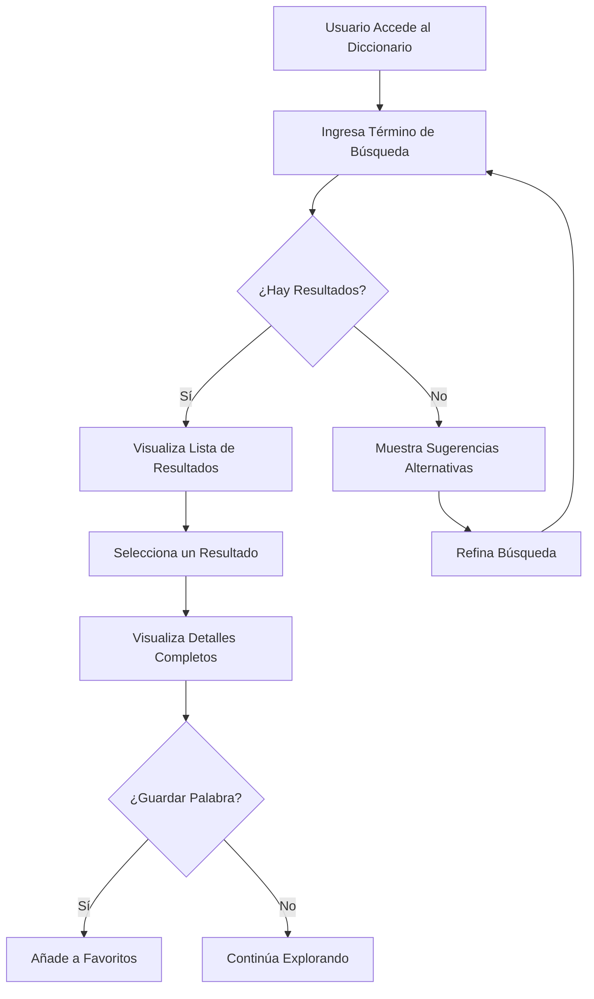
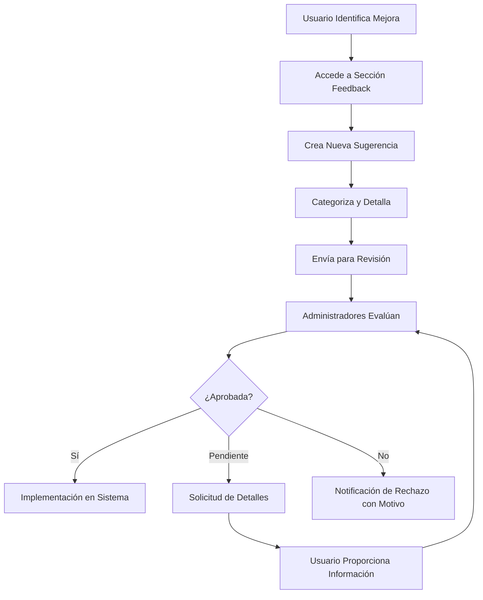
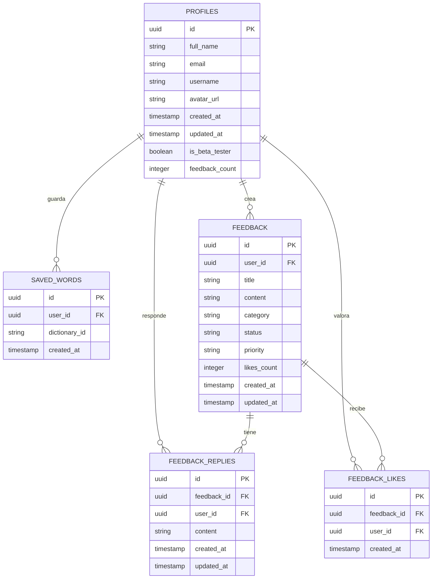

# 🌸 Nawatlahtol - Plataforma Colaborativa de Aprendizaje Náhuatl

[](https://github.com/joseorteha/nahuatl-web)
[](https://nahuatl-web.vercel.app)
[](LICENSE)
[](CONTRIBUTING.md)

> **Una plataforma educativa moderna para preservar, aprender y contribuir al náhuatl a través de tecnología colaborativa.**

## 🔗 Enlaces Rápidos

- [🌐 **Demo en Vivo**](https://nahuatl-web.vercel.app) 
- [📖 **Documentación Completa**](./docs/)
- [🚀 **Guía de Instalación**](#-instalación-rápida)
- [🤝 **Cómo Contribuir**](#-cómo-contribuir)
- [🐛 **Reportar Problemas**](https://github.com/joseorteha/nahuatl-web/issues)

---

## 📋 Tabla de Contenidos

1. [📖 Acerca del Proyecto](#-acerca-del-proyecto)
2. [✨ Características](#-características)
3. [🚀 Instalación y Configuración](#-instalación-y-configuración)
4. [🏗️ Arquitectura](#️-arquitectura)
5. [📁 Estructura del Proyecto](#-estructura-del-proyecto)
6. [� Desarrollo](#-desarrollo)
7. [🤝 Contribuir](#-contribuir)
8. [� Documentación](#-documentación)
9. [�️ Roadmap](#️-roadmap)
10. [� Licencia](#-licencia)

---

## 📖 Acerca del Proyecto

### � Misión

**Nawatlahtol** es una plataforma educativa colaborativa que utiliza tecnologías modernas para preservar, difundir y enseñar la lengua náhuatl. Nuestro objetivo es crear una comunidad activa donde hablantes, estudiantes y entusiastas contribuyan juntos a la revitalización de esta importante lengua indígena de México.

### � Objetivos

| Objetivo | Descripción | Estado |
|----------|-------------|---------|
| **🏛️ Preservación Cultural** | Documentar y preservar el náhuatl como patrimonio inmaterial | ✅ Activo |
| **📚 Educación Accesible** | Herramientas gratuitas para aprendizaje del náhuatl | ✅ Implementado |
| **🤝 Comunidad Colaborativa** | Red de contribuyentes para enriquecimiento continuo | ✅ Nuevo |
| **🚀 Innovación Tecnológica** | Tecnologías modernas para métodos educativos efectivos | ✅ Continuo |

### 👥 Dirigido a

- 🎓 **Estudiantes** interesados en aprender náhuatl
- 🌱 **Personas con raíces culturales** que desean reconectar con su herencia
- 🔬 **Investigadores y lingüistas** enfocados en lenguas indígenas
- 👨‍🏫 **Educadores** que buscan recursos para enseñanza
- ❤️ **Entusiastas** de la cultura y lenguas mesoamericanas

---

## ✨ Características

### �️ Funcionalidades Principales

| Funcionalidad | Descripción | Estado |
|---------------|-------------|---------|
| **📖 Diccionario Interactivo** | 3,500+ palabras con definicion y ejemplos | ✅ Estable |
| **� Sistema de Lecciones** | Contenido educativo estructurado y progresivo | ✅ Estable |
| **👤 Gestión de Usuarios** | Perfiles, autenticación y roles | ✅ Estable |
| **⭐ Palabras Guardadas** | Sistema de favoritos personalizado | ✅ Estable |
| **💬 Sistema de Comunidad** | Feedback, discusiones y colaboración | ✅ Mejorado |

### 🆕 Sistema de Contribuciones Colaborativas

> ✨ **Lanzado en v2.0 - Septiembre 2025**

- ✅ **Contribuciones de Palabras**: Los usuarios pueden proponer nuevas palabras al diccionario
- ✅ **Panel de Moderación**: Admins y moderadores revisan y aprueban contribuciones
- ✅ **Workflow Completo**: Desde propuesta hasta publicación automática
- ✅ **Historial de Contribuciones**: Tracking completo de contribuciones por usuario

### 🔒 Sistema de Roles

| Rol | Permisos | Funcionalidades |
|-----|----------|----------------|
| **👤 Usuario** | Básicos | Buscar, guardar palabras, contribuir |
| **🛡️ Moderador** | Moderación | + Revisar contribuciones, moderar comunidad |
| **⚡ Admin** | Completos | + Gestión total, estadísticas, configuración |

---

## 🚀 Instalación y Configuración

### 📋 Requisitos Previos

```bash
Node.js     ≥ 18.0.0    # Runtime principal
npm         ≥ 9.0.0     # Gestor de paquetes  
Git         ≥ 2.0.0     # Control de versiones
```

### ⚡ Instalación Rápida

```bash
# 1. Clonar repositorio
git clone https://github.com/joseorteha/nahuatl-web.git
cd nahuatl-web

# 2. Configurar Frontend
cd frontend
npm install

# 3. Configurar Backend  
cd ../backend
npm install

# 4. Configurar variables de entorno
cp .env.example .env.local  # En frontend/
cp .env.example .env        # En backend/
# Editar archivos .env con credenciales Supabase

# 5. Configurar Base de Datos
# Ejecutar BD.sql en Supabase
# Ejecutar BD_CONTRIBUCIONES.sql para sistema de contribuciones

# 6. Iniciar desarrollo
cd frontend && npm run dev    # Puerto 3000
cd backend && npm start       # Puerto 3001
```

### 🔐 Variables de Entorno

#### Frontend (`frontend/.env.local`)
```bash
NEXT_PUBLIC_SUPABASE_URL=tu_supabase_url
NEXT_PUBLIC_SUPABASE_ANON_KEY=tu_supabase_anon_key
NEXT_PUBLIC_API_URL=http://localhost:3001
```

#### Backend (`backend/.env`)
```bash
SUPABASE_URL=tu_supabase_url
SUPABASE_SERVICE_KEY=tu_supabase_service_role_key
PORT=3001
```

### 🗄️ Configuración de Base de Datos

1. **Crear proyecto en Supabase**
2. **Ejecutar scripts SQL**:
   - `BD.sql` - Schema principal
   - `BD_CONTRIBUCIONES.sql` - Sistema de contribuciones
3. **Configurar Row Level Security (RLS)**
4. **Obtener credenciales del proyecto**

Para más detalles, consulta [SUPABASE_SETUP.md](SUPABASE_SETUP.md).

---

## 🏗️ Arquitectura

### 🎨 Stack Tecnológico

```
🎯 FRONTEND               🔧 BACKEND                🗄️ BASE DE DATOS
├── Next.js 15.3.4        ├── Node.js + Express     ├── Supabase PostgreSQL
├── TypeScript             ├── Supabase Client       ├── Row Level Security
├── Tailwind CSS           ├── CORS + JSON Parser    ├── Real-time subscriptions
├── Headless UI            ├── API RESTful           └── Cloud Storage
└── PWA Ready              └── Middleware Auth       

📦 DEPLOYMENT             🛡️ SEGURIDAD              🔄 INTEGRACIONES
├── Vercel (Frontend)      ├── JWT Authentication    ├── GitHub Actions
├── Render (Backend)       ├── Role-based Access     ├── API Rate Limiting
├── Supabase Cloud         ├── Input Validation      └── Error Monitoring
└── CDN Global             └── HTTPS Everywhere      
```

### 🏛️ Diagrama de Arquitectura



### 🔄 Flujo de Datos

```
👤 Usuario → 🌐 Next.js Router → ⚡ Express API → 🛡️ Auth → 🗄️ Supabase → 📊 Datos → 🎨 UI
```

---

## 📁 Estructura del Proyecto

### 🗂️ Estructura Principal

```
nahuatl-web/
├── 📋 BD.sql                       # Schema inicial de base de datos
├── 🌸 BD_CONTRIBUCIONES.sql       # Schema de contribuciones
├── 📚 README.md                   # Este archivo
├── ⚙️ SUPABASE_SETUP.md           # Guía de configuración de Supabase
├── 🚀 vercel.json                 # Configuración de deploy
│
├── 🔧 backend/                    # Servidor API Express.js
│   ├── 📜 index.js                # Punto de entrada del servidor
│   ├── 📦 package.json            # Dependencias del backend
│   ├── 📖 README.md               # Documentación del backend
│   └── 🗂️ data/                   # Archivos JSON estáticos
│       ├── 📖 dictionary.json     # 4,300+ palabras Náhuatl-Español
│       ├── 📚 lecciones.json      # Lecciones estructuradas
│       └── 📝 vocabulario.json    # Vocabulario temático
│
└── 🎨 frontend/                   # Aplicación Next.js
    ├── 📦 package.json            # Dependencias del frontend
    ├── ⚙️ next.config.ts          # Configuración Next.js
    ├── 🎨 tailwind.config.js      # Configuración Tailwind CSS
    ├── 📘 tsconfig.json           # Configuración TypeScript
    ├── 📁 public/                 # Recursos estáticos
    ├── 🔧 scripts/                # Scripts de utilidad
    └── 💻 src/                    # Código fuente principal
        ├── 🛡️ middleware.ts       # Middleware de autenticación
        ├── 📱 app/                # Rutas y páginas (App Router)
        ├── 🧩 components/         # Componentes reutilizables
        └── 📚 lib/                # Utilidades y configuraciones
```

### 🎯 Frontend: Páginas Principales

```
📱 src/app/
├── 🏠 page.tsx                   # Landing page
├── 📖 diccionario/page.tsx       # Motor de búsqueda del diccionario
├── 📊 dashboard/page.tsx         # Dashboard del usuario
├── 🔐 login/page.tsx             # Sistema de autenticación
├── 👤 profile/page.tsx           # Gestión de perfil
├── 💬 feedback/page.tsx          # Sistema de comunidad
├── 🌸 contribuir/page.tsx        # Portal de contribuciones ✨
├── ⚡ admin/page.tsx             # Panel de moderación ✨
└── 🔐 auth/callback/route.ts     # Callback de autenticación
```

### 🔧 Backend: Endpoints API

```
🖥️ API Endpoints:
├── 📖 /api/dictionary            # Búsqueda en diccionario
├── 📚 /api/lessons               # Gestión de lecciones  
├── 💬 /api/feedback              # Sistema de retroalimentación
├── ⭐ /api/saved-words           # Palabras guardadas
├── 🌸 /api/contributions         # Gestión de contribuciones ✨
└── ⚡ /api/admin/contributions   # Panel de moderación ✨
```

---

## 🔧 Desarrollo

### 🛠️ Scripts Disponibles

#### Frontend
```bash
npm run dev        # Servidor de desarrollo
npm run build      # Build de producción
npm run start      # Servidor de producción
npm run lint       # Linter ESLint
npm run type-check # Verificación TypeScript
```

#### Backend
```bash
npm start          # Servidor de producción
npm run dev        # Servidor de desarrollo con nodemon
npm test           # Ejecutar pruebas
```

### 🧪 Testing

```bash
# Frontend
npm run test       # Jest + React Testing Library
npm run test:e2e   # Pruebas end-to-end con Playwright

# Backend
npm test           # Pruebas unitarias con Jest
npm run test:api   # Pruebas de API
```

### 📊 Calidad de Código

- ✅ **TypeScript**: Tipado estricto en todo el proyecto
- ✅ **ESLint**: Linting configurado con reglas estrictas
- ✅ **Prettier**: Formateo automático de código
- ✅ **Husky**: Git hooks para calidad pre-commit

### 🐛 Debugging

```bash
# Frontend
npm run dev        # DevTools habilitadas por defecto

# Backend
npm run debug      # Node.js inspector en puerto 9229
```

---

## 🤝 Contribuir

### 🎯 Formas de Contribuir

| Tipo | Descripción | Nivel | Tiempo |
|------|-------------|-------|---------|
| 🐛 **Bug Reports** | Reportar errores encontrados | Principiante | 5-15 min |
| 🌸 **Contribuciones de Palabras** | Añadir palabras al diccionario | Principiante | 5-10 min |
| 💡 **Sugerencias** | Ideas de mejora via `/feedback` | Principiante | 10-20 min |
| 🧑‍💻 **Código** | Mejoras de código y nuevas features | Intermedio | 1-8 horas |
| 📖 **Documentación** | Mejorar guías y documentos | Intermedio | 30min-2h |
| 🎨 **Diseño UI/UX** | Mejoras de interfaz | Avanzado | 2-8 horas |

### 🚀 Proceso de Contribución

```bash
# 1. Fork del repositorio
git clone https://github.com/tu-usuario/nahuatl-web.git

# 2. Crear rama para feature
git checkout -b feature/mi-nueva-caracteristica

# 3. Hacer cambios y commits
git add .
git commit -m "feat: agregar nueva característica X"

# 4. Push y crear Pull Request
git push origin feature/mi-nueva-caracteristica
```

### 📏 Estándares de Código

- ✅ **Commits**: Seguir [Conventional Commits](https://conventionalcommits.org/)
- ✅ **TypeScript**: Código tipificado estrictamente  
- ✅ **ESLint**: Sin warnings en build
- ✅ **Testing**: Probar cambios localmente

### 🌸 Sistema de Contribuciones de Palabras

#### Flujo de Contribución



#### Estructura de Contribución

```json
{
  "palabra_nahuatl": "Xochitl",
  "traduccion_espanol": "Flor",
  "categoria": "Sustantivo",
  "ejemplo_uso": "In xochitl cualli = La flor es bonita",
  "fuente": "Diccionario de Andrews",
  "estado": "pendiente | aprobada | rechazada | publicada"
}
```

---

## 📚 Documentación

### 📖 Documentación Disponible

- **[📋 README.md](README.md)** - Este archivo (vista general)
- **[🔧 SETUP.md](frontend/SETUP.md)** - Guía de configuración detallada
- **[🗄️ SUPABASE_SETUP.md](SUPABASE_SETUP.md)** - Configuración de base de datos
- **[🎨 DOCUMENTACION_FRONTEND.md](frontend/DOCUMENTACION_FRONTEND.md)** - Documentación del frontend
- **[🔧 DOCUMENTACION_BACKEND.md](backend/DOCUMENTACION_BACKEND.md)** - Documentación del backend
- **[📁 docs/](docs/)** - Documentación modular completa

### 🔗 Enlaces Útiles

- **[🌐 Demo en Vivo](https://nahuatl-web.vercel.app)**
- **[📊 Estado del Sistema](https://nahuatl-web.vercel.app/status)**
- **[🐛 Reportar Issues](https://github.com/joseorteha/nahuatl-web/issues)**
- **[💬 Discusiones](https://github.com/joseorteha/nahuatl-web/discussions)**

---

## 🗺️ Roadmap

### 🎯 Versión Actual: v2.1.0 *(Septiembre 2025)*

✅ **Completado:**
- [x] Sistema de contribuciones colaborativas
- [x] Panel de moderación con workflow de aprobación
- [x] Roles de usuario (Usuario/Moderador/Admin)
- [x] Publicación automática al diccionario
- [x] Sistema de comunidad mejorado

### 🔄 v2.2.0 - Mejoras de Experiencia *(Octubre 2025)*

🚧 **En Desarrollo:**
- [ ] **🔔 Sistema de Notificaciones**
  - Notificaciones en tiempo real para moderadores
  - Alertas de estado de contribuciones
- [ ] **📊 Dashboard Avanzado**  
  - Estadísticas de contribuciones
  - Métricas de calidad
- [ ] **🔍 Búsqueda Avanzada**
  - Filtros por categoría
  - Búsqueda fonética

### 🌟 v2.3.0 - Funcionalidades Educativas *(Noviembre 2025)*

🎓 **Planeado:**
- [ ] **📚 Sistema de Lecciones Interactivas**
- [ ] **🎯 Gamificación**
- [ ] **🔊 Pronunciación con Audio**

### 🚀 v3.0.0 - Plataforma Social *(Q1 2026)*

🤝 **Visión:**
- [ ] **👥 Perfiles Extendidos**
- [ ] **💬 Chat y Mensajería**
- [ ] **🏆 Sistema de Certificaciones**

### 🔧 Mejoras Técnicas Continuas

- [ ] **⚡ Optimización de Performance**
- [ ] **📱 PWA Avanzada**
- [ ] **🔐 Seguridad Mejorada**
- [ ] **🧪 Testing Comprehensivo**

---

## 📊 Estado del Proyecto

### 🌐 URLs de Producción

- **Frontend**: [https://nahuatl-web.vercel.app](https://nahuatl-web.vercel.app)
- **Backend API**: [https://nahuatl-web.onrender.com](https://nahuatl-web.onrender.com)
- **Base de Datos**: Supabase Cloud (privada)

### 📈 Estadísticas

```
🟢 Frontend (Vercel)     │ ✅ Operacional  │ 99.9% uptime
🟢 Backend (Render)      │ ✅ Operacional  │ 99.5% uptime  
🟢 Database (Supabase)   │ ✅ Operacional  │ 99.9% uptime
🟢 Build Status          │ ✅ Passing      │ Sin errores
```

### 🔄 CI/CD

- ✅ **Deploy Automático**: Push a `main` → Deploy automático
- ✅ **Build Checks**: TypeScript + ESLint validation
- ✅ **Environment Variables**: Configuradas de forma segura

---

## ❓ Preguntas Frecuentes

### 🔍 General

**¿Qué es Nawatlahtol?**  
Una plataforma web colaborativa para aprender náhuatl que combina un diccionario interactivo con un sistema de contribuciones comunitarias.

**¿Es gratuito?**  
Sí, completamente gratuito y open source.

**¿Necesito crear cuenta?**  
Para funciones básicas (búsqueda) no, pero para contribuir y guardar palabras sí.

### 🌸 Contribuciones

**¿Cómo puedo agregar una palabra nueva?**  
1. Regístrate e inicia sesión
2. Ve a "Contribuir" 
3. Completa el formulario
4. Espera la revisión

**¿Cuánto tarda en aprobarse?**  
Generalmente 1-3 días, dependiendo de la calidad de la información.

### 🛠️ Técnica

**¿Cómo reporto un bug?**  
Usa la sección "Comunidad" en la plataforma o crea un [issue en GitHub](https://github.com/joseorteha/nahuatl-web/issues).

**¿Puedo contribuir con código?**  
¡Absolutamente! Fork el repo, haz tus cambios y envía un Pull Request.

---

## 📞 Contacto y Comunidad

### 🌐 Enlaces de la Comunidad

- 💬 **Feedback**: [Página de Comunidad](https://nahuatl-web.vercel.app/feedback)
- 🐛 **Issues**: [GitHub Issues](https://github.com/joseorteha/nahuatl-web/issues)
- 💡 **Discusiones**: [GitHub Discussions](https://github.com/joseorteha/nahuatl-web/discussions)
- 📧 **Email**: joseortegahac@gmail.com

### 👨‍💻 Desarrollador Principal

**José Ortega** - Desarrollo Full-Stack, Arquitectura, Documentación  
📧 joseortegahac@gmail.com

---

## 📄 Licencia

Este proyecto está licenciado bajo la **MIT License** - ve el archivo [LICENSE](LICENSE) para detalles.

### 🙏 Reconocimientos

**Tecnologías:**
- ⚛️ React/Next.js, 🎨 Tailwind CSS, 🗄️ Supabase, 🚀 Vercel

**Fuentes de Datos:**
- 📖 Compilación de fuentes académicas de náhuatl
- 🏛️ Instituto Nacional de Lenguas Indígenas (INALI)

**Inspiración:**
- 🌺 Cultura Náhuatl y pueblos originarios de México
- 🎯 Movimiento de revitalización de lenguas indígenas

---

## 🌸 Mensaje Final

**¡Gracias por ser parte de la preservación del náhuatl!**

Cada contribución, por pequeña que sea, ayuda a mantener viva esta hermosa lengua y cultura. Juntos podemos construir un futuro donde el náhuatl continúe floreciendo en el mundo digital.

---

*Documentación actualizada: Septiembre 2025 - v2.1.0*  
*Última actualización: 8 de septiembre de 2025*

**Tlazohcamati (Gracias) por usar Nawatlahtol 🌸**
## 📁 Estructura del Repositorio

### 🗂️ **Estructura de Alto Nivel**

```
nahuatl-web/
├── 📋 BD.sql                       # Schema inicial de base de datos
├── 🌸 BD_CONTRIBUCIONES.sql       # ✨ NUEVO: Schema de contribuciones
├── 📚 Readme.md                   # Documentación principal (ESTE ARCHIVO)
├── ⚙️ SUPABASE_SETUP.md           # Guía de configuración de Supabase
├── 🚀 vercel.json                 # Configuración de deploy Vercel
├── 🔧 backend/                    # 🖥️ Servidor API Express.js
│   ├── 📜 index.js                # Punto de entrada del servidor
│   ├── 📦 package.json            # Dependencias del backend
│   ├── 📖 README.md               # Documentación específica del backend
│   ├── 📄 DOCUMENTACION_BACKEND.md # Guía técnica detallada
│   └── 🗂️ data/                   # Archivos JSON estáticos
│       ├── 📖 dictionary.json     # 4,300+ palabras Náhuatl-Español
│       ├── 📚 lecciones.json      # Lecciones estructuradas (ES)
│       ├── 📚 lessons.json        # Lecciones estructuradas (EN)
│       └── 📝 vocabulario.json    # Vocabulario temático
└── 🎨 frontend/                   # 🌐 Aplicación Next.js
    ├── 📦 package.json            # Dependencias del frontend
    ├── ⚙️ next.config.ts          # Configuración Next.js 15
    ├── 🎨 tailwind.config.js      # Configuración Tailwind CSS
    ├── 📘 tsconfig.json           # Configuración TypeScript
    ├── 📖 README.md               # Documentación del frontend
    ├── 📄 DOCUMENTACION_FRONTEND.md # Guía técnica detallada
    ├── 📄 SETUP.md                # Guía de configuración
    ├── 📄 SUPABASE_SETUP.md       # Setup específico Supabase
    ├── 📁 public/                 # Recursos estáticos
    │   ├── 🌸 logo.png            # Logo de la aplicación
    │   ├── 👤 jose.jpeg           # Avatar del desarrollador
    │   └── 🎨 *.svg               # Iconos y gráficos
    ├── 🔧 scripts/                # Scripts de utilidad
    │   └── ✅ check-env.js        # Validador de variables de entorno
    └── 💻 src/                    # 🧠 Código fuente principal
        ├── 🛡️ middleware.ts       # Middleware de autenticación
        ├── 📱 app/                # 🗂️ Rutas y páginas (App Router)
        ├── 🧩 components/         # 🔄 Componentes reutilizables
        └── 📚 lib/                # 🛠️ Utilidades y configuraciones
```

### 🆕 **Archivos Nuevos del Sistema de Contribuciones**

```
📁 frontend/src/app/
├── 🌸 contribuir/page.tsx         # ✨ NUEVO: Página de contribuciones
├── ⚡ admin/page.tsx              # ✨ NUEVO: Panel de administración
└── 🤝 ContributeWordForm.tsx     # ✨ NUEVO: Formulario de contribución

🗄️ Base de Datos:
├── 🌸 BD_CONTRIBUCIONES.sql      # ✨ NUEVO: Schema completo de contribuciones
├── 👥 tabla: perfiles             # ⬆️ ACTUALIZADA: + campo 'rol'
└── 🌸 tabla: contribuciones_diccionario # ✨ NUEVA: Gestión de contribuciones
```

### 🎯 **Frontend: Arquitectura de Componentes**

```
📱 src/app/ (Next.js App Router)
├── 🏠 layout.tsx                  # Layout base con Header/Footer
├── 🌟 page.tsx                   # Landing page con animaciones
├── 📖 diccionario/page.tsx       # Motor de búsqueda del diccionario
├── 📊 dashboard/page.tsx         # Dashboard personalizado del usuario
├── 🔐 login/page.tsx             # Sistema de autenticación
├── 👤 profile/page.tsx           # Gestión de perfil de usuario
├── 💬 feedback/page.tsx          # ⬆️ MEJORADO: Sistema de comunidad
├── ❓ faq/page.tsx               # Preguntas frecuentes
├── 👥 nosotros/page.tsx          # Información del proyecto
├── 🌸 contribuir/page.tsx        # ✨ NUEVO: Portal de contribuciones
├── ⚡ admin/page.tsx             # ✨ NUEVO: Panel de moderación
└── 🔐 auth/callback/route.ts     # Callback de autenticación Supabase

🧩 components/ (Componentes Reutilizables)
├── 🧭 Header.tsx                 # ⬆️ MEJORADO: Navegación con roles
├── 🦶 Footer.tsx                # Pie de página con enlaces
├── 🎯 Quiz.tsx                  # Sistema de cuestionarios
├── 🌈 AnimatedBackground.tsx    # Fondo dinámico de la landing
├── 🚪 LogoutButton.tsx          # Botón de cierre de sesión
├── 🧭 Navbar.tsx               # Navegación móvil
├── 📱 LandingHeader.tsx        # Header específico de landing
└── ⏳ ComingSoon.tsx           # Componente de "próximamente"
```

### 🔧 **Backend: Estructura de API**

```
🖥️ backend/
├── 📜 index.js                   # ⬆️ AMPLIADO: Servidor Express con nuevos endpoints
├── 📁 data/                     # Archivos JSON estáticos
│   ├── 📖 dictionary.json       # 4,300+ entradas del diccionario
│   ├── 📚 lessons.json          # Lecciones interactivas
│   └── 📝 vocabulario.json      # Vocabulario temático
└── 🛠️ Endpoints API:
    ├── 📖 /api/dictionary        # Búsqueda en diccionario
    ├── 📚 /api/lessons           # Gestión de lecciones  
    ├── 💬 /api/feedback          # Sistema de retroalimentación
    ├── ⭐ /api/saved-words       # Palabras guardadas
    ├── 🌸 /api/contributions     # ✨ NUEVO: Gestión de contribuciones
    ├── 👥 /api/contributions/user # ✨ NUEVO: Contribuciones por usuario
    ├── ⚡ /api/admin/contributions # ✨ NUEVO: Panel de moderación
    └── ✅ /api/admin/contributions/:id # ✨ NUEVO: Aprobar/rechazar
```

---

## 🚀 Configuración y Desarrollo

### 📋 **Requisitos Previos**

```bash
# Versiones recomendadas
Node.js     ≥ 18.0.0    # Runtime principal
npm         ≥ 9.0.0     # Gestor de paquetes  
Git         ≥ 2.0.0     # Control de versiones
```

### ⚡ **Instalación Rápida**

```bash
# 1. Clonar repositorio
git clone https://github.com/joseorteha/nahuatl-web.git
cd nahuatl-web

# 2. Configurar Frontend
cd frontend
npm install
cp .env.example .env.local
# Editar .env.local con credenciales Supabase

# 3. Configurar Backend  
cd ../backend
npm install
cp .env.example .env
# Editar .env con credenciales Supabase

# 4. Configurar Base de Datos
# Ejecutar BD.sql en Supabase
# Ejecutar BD_CONTRIBUCIONES.sql para sistema de contribuciones

# 5. Iniciar desarrollo
npm run dev        # En frontend/ (puerto 3000)
npm start          # En backend/ (puerto 3001)
```

### 🔐 **Variables de Entorno Requeridas**

```bash
# frontend/.env.local
NEXT_PUBLIC_SUPABASE_URL=tu_supabase_url
NEXT_PUBLIC_SUPABASE_ANON_KEY=tu_supabase_anon_key
NEXT_PUBLIC_API_URL=http://localhost:3001

# backend/.env  
SUPABASE_URL=tu_supabase_url
SUPABASE_SERVICE_KEY=tu_supabase_service_role_key
PORT=3001
```

---

## 🔒 Sistema de Roles y Permisos

### 👥 **Niveles de Acceso**

| Rol | Características | Permisos | Acceso Especial |
|-----|---------------|----------|-----------------|
| **👤 Usuario** | Cuenta básica registrada | • Búscar diccionario<br>• Guardar palabras<br>• Contribuir palabras<br>• Participar en comunidad | Ninguno |
| **🛡️ Moderador** | Usuario con permisos de moderación | • Todo lo de Usuario<br>• Revisar contribuciones<br>• Moderar comunidad<br>• Gestionar reportes | `/admin` (limitado) |
| **⚡ Admin** | Control total del sistema | • Todo lo anterior<br>• Gestión de usuarios<br>• Configuración del sistema<br>• Estadísticas completas | `/admin` (completo) |

### 🔐 **Control de Acceso**

```typescript
// Ejemplo de middleware de autorización
const checkRole = (requiredRole: 'usuario' | 'moderador' | 'admin') => {
  return (req: Request, res: Response, next: NextFunction) => {
    const userRole = req.user?.rol;
    
    const roleHierarchy = {
      'usuario': 1,
      'moderador': 2, 
      'admin': 3
    };
    
    if (roleHierarchy[userRole] >= roleHierarchy[requiredRole]) {
      next();
    } else {
      res.status(403).json({ error: 'Acceso denegado' });
    }
  };
};
```

---

## 🌸 Sistema de Contribuciones

### 🎯 **Flujo Completo de Contribución**



### 📋 **Estructura de Contribución**

```json
{
  "id": "uuid",
  "palabra_nahuatl": "Xochitl",
  "traduccion_espanol": "Flor",
  "categoria": "Sustantivo",
  "ejemplo_uso": "In xochitl cualli = La flor es bonita",
  "fuente": "Diccionario de Andrews",
  "estado": "pendiente | aprobada | rechazada | publicada",
  "nivel_confianza": "alto | medio | bajo",
  "razon_contribucion": "Palabra faltante en diccionario",
  "fecha_contribucion": "2025-09-06T12:00:00Z",
  "fecha_revision": null,
  "comentarios_revision": null,
  "usuario_id": "uuid",
  "admin_revisor_id": null
}
```

### 🛡️ **Panel de Moderación**

**Características del Panel Admin:**
- ✅ **Vista de contribuciones** pendientes/todas  
- ✅ **Filtros avanzados** por estado, fecha, usuario
- ✅ **Revisión detallada** con información completa
- ✅ **Aprobación/Rechazo** con comentarios
- ✅ **Publicación automática** al diccionario principal
- ✅ **Historial de moderación** con tracking completo

**Estados del Workflow:**
1. **📝 Pendiente**: Esperando revisión de moderador
2. **✅ Aprobada**: Revisada y aprobada por moderador  
3. **❌ Rechazada**: No cumple criterios + feedback
4. **📚 Publicada**: Automáticamente añadida al diccionario

### 🔍 **Criterios de Calidad**

| Criterio | Requerido | Validación |
|----------|-----------|------------|
| **Palabra Náhuatl** | ✅ | No vacía, caracteres válidos |
| **Traducción** | ✅ | No vacía, español correcto |
| **Categoría** | ✅ | Lista predefinida |
| **Ejemplo de Uso** | ⚠️ | Recomendado fuertemente |
| **Fuente** | ⚠️ | Preferible para verificación |
| **Nivel de Confianza** | ✅ | Auto-asignado según completitud |

---

## 📊 Modelo de Datos

### 🗄️ **Esquema de Base de Datos Actualizado**

```sql
-- 👥 TABLA PRINCIPAL DE USUARIOS (ACTUALIZADA)
perfiles (
  id uuid PRIMARY KEY,
  nombre_completo text,
  username text UNIQUE,
  email text UNIQUE,
  url_avatar text,
  fecha_registro timestamp DEFAULT now(),
  rol text DEFAULT 'usuario' CHECK (rol IN ('usuario', 'moderador', 'admin')) -- ✨ NUEVO
);

-- 🌸 TABLA DE CONTRIBUCIONES (NUEVA)
contribuciones_diccionario (
  id uuid PRIMARY KEY DEFAULT gen_random_uuid(),
  palabra_nahuatl text NOT NULL,
  traduccion_espanol text NOT NULL,  
  categoria text NOT NULL,
  ejemplo_uso text,
  fuente text,
  estado text DEFAULT 'pendiente' CHECK (estado IN ('pendiente', 'aprobada', 'rechazada', 'publicada')),
  nivel_confianza text DEFAULT 'medio' CHECK (nivel_confianza IN ('alto', 'medio', 'bajo')),
  razon_contribucion text,
  fecha_contribucion timestamp DEFAULT now(),
  fecha_revision timestamp,
  comentarios_revision text,
  usuario_id uuid REFERENCES perfiles(id) ON DELETE CASCADE,
  admin_revisor_id uuid REFERENCES perfiles(id),
  created_at timestamp DEFAULT now(),
  updated_at timestamp DEFAULT now()
);

-- 📖 TABLA DEL DICCIONARIO PRINCIPAL
diccionario_nawatl (
  id uuid PRIMARY KEY DEFAULT gen_random_uuid(),
  word text NOT NULL,
  definition text NOT NULL,
  info_gramatical text,
  fuente_contribucion uuid REFERENCES contribuciones_diccionario(id) -- ✨ NUEVO: Tracking de origen
);

-- 💬 TABLA DE RETROALIMENTACIÓN DE COMUNIDAD
retroalimentacion (
  id uuid PRIMARY KEY,
  titulo text NOT NULL,
  contenido text NOT NULL,
  categoria text,
  estado text DEFAULT 'abierto',
  fecha_creacion timestamp DEFAULT now(),
  usuario_id uuid REFERENCES perfiles(id)
);

-- ⭐ TABLA DE PALABRAS GUARDADAS
palabras_guardadas (
  id uuid PRIMARY KEY,
  usuario_id uuid REFERENCES perfiles(id),
  palabra_id uuid,
  fecha_guardado timestamp DEFAULT now()
);
```

### 🔗 **Relaciones Clave**

```
perfiles (1) ──── (N) contribuciones_diccionario
perfiles (1) ──── (N) retroalimentacion  
perfiles (1) ──── (N) palabras_guardadas
contribuciones_diccionario (1) ──── (1) diccionario_nawatl [opcional]
```

---

## 🔄 Flujos de Usuario

### 🌸 **Flujo de Contribución de Palabras**

```
1. 👤 Usuario registrado accede a /contribuir
   ↓
2. 📝 Completa formulario de nueva palabra
   ├── Palabra en náhuatl (requerido)
   ├── Traducción al español (requerido)  
   ├── Categoría gramatical (requerido)
   ├── Ejemplo de uso (opcional)
   └── Fuente/referencia (opcional)
   ↓
3. ✅ Validación frontend + backend
   ↓
4. 💾 Guardado en tabla contribuciones_diccionario
   ↓
5. 📧 Notificación automática a moderadores
   ↓
6. 🛡️ Moderador/Admin revisa en /admin
   ├── ✅ Aprobar → Estado: 'aprobada' → Auto-publicar
   └── ❌ Rechazar → Estado: 'rechazada' + comentarios
   ↓
7. 📚 Si aprobada: Inserción automática en diccionario_nawatl
   ↓
8. 🔍 Palabra disponible inmediatamente en búsquedas
```

### 🛡️ **Flujo de Moderación**

```
1. 🛡️ Moderador/Admin accede a /admin
   ↓
2. 📊 Ve dashboard con contribuciones pendientes
   ↓
3. 🔍 Filtra por estado/fecha/usuario
   ↓
4. 👁️ Selecciona contribución para revisar
   ↓
5. 📱 Modal con información completa:
   ├── Datos de la palabra
   ├── Información del contribuyente
   ├── Fecha de contribución
   └── Nivel de confianza calculado
   ↓
6. 🎯 Toma decisión:
   ├── ✅ Aprobar (con comentarios opcionales)
   └── ❌ Rechazar (con comentarios requeridos)
   ↓
7. 💾 Actualización automática del estado
   ↓
---

## 🗺️ Roadmap y Desarrollo Futuro

### 🎯 **Versión Actual: v2.1.0** *(Septiembre 2025)*

✅ **Características Implementadas:**
- [x] Sistema de contribuciones colaborativas completo
- [x] Panel de moderación con workflow de aprobación
- [x] Roles de usuario (Usuario/Moderador/Admin)
- [x] Publicación automática al diccionario
- [x] Historial de contribuciones por usuario
- [x] Sistema de comunidad mejorado con manejo de fechas
- [x] Build optimizado sin errores de TypeScript/ESLint
- [x] Deploy automático con correcciones de mapeo de datos

### � **v2.2.0 - Mejoras de Experiencia** *(Octubre 2025)*

🔄 **En Planificación:**
- [ ] **🔔 Sistema de Notificaciones**
  - Notificaciones en tiempo real para moderadores
  - Alertas de estado de contribuciones para usuarios
  - Email notifications para contribuciones importantes

- [ ] **📊 Dashboard Avanzado**  
  - Estadísticas de contribuciones por usuario
  - Métricas de calidad y aprobación
  - Leaderboard de contribuyentes

- [ ] **🔍 Búsqueda Avanzada**
  - Filtros por categoría gramatical
  - Búsqueda fonética aproximada
  - Sugerencias inteligentes

### 🌟 **v2.3.0 - Funcionalidades Educativas** *(Noviembre 2025)*

🎓 **Nuevas Características:**
- [ ] **📚 Sistema de Lecciones Interactivas**
  - Lecciones progresivas estructuradas
  - Ejercicios de pronunciación
  - Quizzes adaptativos

- [ ] **🎯 Gamificación**
  - Sistema de puntos y logros
  - Desafíos diarios de vocabulario
  - Racha de aprendizaje

- [ ] **🔊 Pronunciación**
  - Audio recordings para palabras principales
  - Reconocimiento de voz básico
  - Guías de pronunciación fonética

### 🚀 **v3.0.0 - Plataforma Social** *(Q1 2026)*

🤝 **Características Sociales:**
- [ ] **👥 Perfiles de Usuario Extendidos**
  - Biografías y especialidades
  - Historial de contribuciones público
  - Sistema de seguimiento

- [ ] **💬 Chat y Mensajería**
  - Mensajes directos entre usuarios
  - Grupos de estudio
  - Foros temáticos

- [ ] **🏆 Certificaciones**
  - Niveles de competencia verificados
  - Badges por especialidades
  - Exportación de certificados

### 🔧 **Mejoras Técnicas Continuas**

**Infraestructura:**
- [ ] **⚡ Optimización de Performance**
  - Lazy loading de componentes
  - Caching inteligente
  - CDN para recursos estáticos

- [ ] **📱 PWA Avanzada**
  - Sincronización offline
  - Push notifications
  - Instalación como app nativa

- [ ] **🔐 Seguridad Mejorada**
  - Rate limiting avanzado
  - Validación de entrada robusta
  - Audit logs completos

**Calidad del Código:**
- [ ] **🧪 Testing Comprehensivo**
  - Unit tests para componentes críticos
  - Integration tests para API
  - E2E tests para flujos principales

- [ ] **📊 Monitoreo y Analytics**
  - Error tracking con Sentry
  - Performance monitoring
  - Usage analytics

### � **Ideas Futuras** *(Backlog)*

**Características Experimentales:**
- [ ] **🤖 IA y Machine Learning**
  - Sugerencias automáticas de traducciones
  - Detección de errores comunes
  - Análisis de calidad de contribuciones

- [ ] **🌐 Multiidioma**
  - Soporte para inglés completo  
  - Traducciones a otros idiomas indígenas
  - Localización cultural

- [ ] **📱 Apps Móviles Nativas**
  - iOS app con Swift
  - Android app con Kotlin
  - Funcionalidades offline expandidas

---

## 🤝 Contribuir al Proyecto

### 🎯 **Formas de Contribuir**

| Tipo | Descripción | Nivel | Tiempo |
|------|-------------|-------|---------|
| 🐛 **Bug Reports** | Reportar errores encontrados | Principiante | 5-15 min |
| 🌸 **Contribuciones de Palabras** | Añadir palabras al diccionario | Principiante | 5-10 min |
| 💡 **Sugerencias** | Ideas de mejora via /feedback | Principiante | 10-20 min |
| 🧑‍💻 **Code Contributions** | Mejoras de código y nuevas features | Intermedio | 1-8 horas |
| 📖 **Documentación** | Mejorar guías y documentos | Intermedio | 30min-2h |
| 🎨 **Diseño UI/UX** | Mejoras de interfaz | Avanzado | 2-8 horas |

### 🚀 **Proceso de Contribución de Código**

```bash
# 1. Fork del repositorio
git clone https://github.com/tu-usuario/nahuatl-web.git

# 2. Crear rama para feature
git checkout -b feature/mi-nueva-caracteristica

# 3. Hacer cambios y commits
git add .
git commit -m "feat: agregar nueva característica X"

# 4. Push y crear Pull Request
git push origin feature/mi-nueva-caracteristica
# Crear PR en GitHub con descripción detallada
```

### � **Estándares de Código**

**Convenciones:**
- ✅ **Commits**: Seguir [Conventional Commits](https://conventionalcommits.org/)
- ✅ **TypeScript**: Código tipificado estrictamente  
- ✅ **ESLint**: Sin warnings en build
- ✅ **Prettier**: Código formateado consistentemente

**Testing:**
- ✅ Probar cambios localmente antes del PR
- ✅ Verificar que `npm run build` funcione sin errores
- ✅ Documentar nuevas funcionalidades

### 👥 **Comunidad y Contacto**

**Recursos de la Comunidad:**
- 💬 **Feedback**: [Página de Comunidad](https://nahuatl-web.vercel.app/feedback)
- 🐛 **Issues**: [GitHub Issues](https://github.com/joseorteha/nahuatl-web/issues)
- 📧 **Email**: joseortegahac@gmail.com
- 🌐 **Demo**: [nahuatl-web.vercel.app](https://nahuatl-web.vercel.app)

---

## 📄 Licencia y Créditos

### 📜 **Licencia**

Este proyecto está licenciado bajo la **MIT License** - ve el archivo [LICENSE](LICENSE) para detalles.

### 🙏 **Créditos y Reconocimientos**

**Desarrollador Principal:**
- 👨‍💻 **José Ortega** - *Desarrollo Full-Stack, Arquitectura, Documentación*

**Tecnologías y Librerías:**
- ⚛️ **React/Next.js** - Framework de desarrollo
- 🎨 **Tailwind CSS** - Framework de estilos
- 🗄️ **Supabase** - Backend-as-a-Service
- 🚀 **Vercel** - Plataforma de deployment

**Fuentes de Datos:**
- 📖 **Diccionario Base**: Compilación de fuentes académicas de náhuatl
- 🏛️ **Referencias Lingüísticas**: Instituto Nacional de Lenguas Indígenas (INALI)
- 📚 **Recursos Educativos**: Comunidad de hablantes y lingüistas

**Inspiración Cultural:**
- 🌺 **Cultura Náhuatl**: Pueblos originarios de México
- 🎯 **Preservación Lingüística**: Movimiento de revitalización de lenguas indígenas

---

## ❓ Preguntas Frecuentes (FAQ)

### 🔍 **General**

**¿Qué es Nawatlahtol?**
Es una plataforma web colaborativa para aprender náhuatl que combina un diccionario interactivo con un sistema de contribuciones comunitarias.

**¿Es gratuito?**
Sí, completamente gratuito y open source.

**¿Necesito crear cuenta?**
Para funciones básicas (búsqueda) no, pero para contribuir, guardar palabras y participar en la comunidad sí necesitas registrarte.

### 🌸 **Contribuciones**

**¿Cómo puedo agregar una palabra nueva?**
1. Regístrate y inicia sesión
2. Ve a la sección "Contribuir" 
3. Completa el formulario con la palabra y su información
4. Espera la revisión de un moderador

**¿Cuánto tarda en aprobarse una contribución?**
Generalmente 1-3 días, dependiendo de la completitud y calidad de la información proporcionada.

**¿Qué pasa si mi contribución es rechazada?**
Recibirás comentarios explicando el motivo y podrás corregir y reenviar la contribución.

### �️ **Técnica**

**¿Cómo reporto un bug?**
Usa la sección "Comunidad" en la plataforma o crea un issue en GitHub.

**¿Puedo contribuir con código?**  
¡Absolutamente! Fork el repo, haz tus cambios y envía un Pull Request.

**¿Dónde está hosteada la aplicación?**
Frontend en Vercel, Backend en Render, Base de datos en Supabase.

---

## 🚀 Deploy y Producción

### 🌐 **URLs de Producción**

- **Frontend**: [https://nahuatl-web.vercel.app](https://nahuatl-web.vercel.app)
- **Backend API**: [https://nahuatl-web.onrender.com](https://nahuatl-web.onrender.com)
- **Base de Datos**: Supabase Cloud (privada)

### 📊 **Estado del Sistema**

```
🟢 Frontend (Vercel)     │ ✅ Operacional  │ 99.9% uptime
🟢 Backend (Render)      │ ✅ Operacional  │ 99.5% uptime  
🟢 Database (Supabase)   │ ✅ Operacional  │ 99.9% uptime
🟢 Build Status          │ ✅ Passing      │ Sin errores
```

### 🔄 **Auto-Deploy**

- ✅ **GitHub → Vercel**: Deploy automático en push a `main`
- ✅ **GitHub → Render**: Deploy automático del backend
- ✅ **Build Checks**: TypeScript + ESLint validation
- ✅ **Environment**: Variables seguras configuradas

---

*Documentación actualizada: Septiembre 2025 - v2.1.0*  
*Última actualización del sistema de contribuciones: Exitosa ✅*

**¡Gracias por ser parte de la preservación del náhuatl! 🌸**

---
   ├── Sugerencia de mejora
   ├── Reporte de error
   ├── Pregunta general
   └── Propuesta de funcionalidad
   ↓
3. 💬 Otros usuarios pueden:
   ├── 👍 Dar "me gusta"
   ├── 💬 Responder/comentar
   └── 📤 Compartir experiencias
   ↓
4. 🛡️ Moderadores pueden:
   ├── 📝 Responder oficialmente
   ├── 🏷️ Etiquetar/categorizar
   └── 🔒 Moderar contenido
```

---
   cp .env.example .env
   # Editar .env con tus credenciales de Supabase
   ```

4. **Configurar Supabase**:
   - Crear un nuevo proyecto en Supabase
   - Ejecutar los scripts SQL de `BD.sql` y `SUPABASE_SETUP.md`
   - Configurar las credenciales en los archivos .env

### Ejecución en Desarrollo

1. **Iniciar el backend**:
   ```bash
   cd backend
   npm run dev
   # El servidor estará disponible en http://localhost:3001
   ```

2. **Iniciar el frontend**:
   ```bash
   cd frontend
   npm run dev
   # La aplicación estará disponible en http://localhost:3000
   ```

### Variables de Entorno

#### Frontend (.env.local)
```
NEXT_PUBLIC_SUPABASE_URL=https://tu-proyecto.supabase.co
NEXT_PUBLIC_SUPABASE_ANON_KEY=tu-clave-publica
NEXT_PUBLIC_API_URL=http://localhost:3001
```

#### Backend (.env)
```
PORT=3001
SUPABASE_URL=https://tu-proyecto.supabase.co
SUPABASE_SERVICE_KEY=tu-clave-de-servicio
```

---

## Características Principales

### 1. Diccionario Interactivo

El diccionario náhuatl-español es el núcleo de la aplicación, ofreciendo:

- **Búsqueda Avanzada**: Sistema inteligente que pondera resultados por relevancia
- **Información Detallada**: Definiciones, ejemplos, notas culturales y etimología
- **Palabras Favoritas**: Capacidad de guardar términos para estudio posterior
- **Ejemplos Contextuales**: Oraciones de ejemplo con traducción

### 2. Sistema de Lecciones

Estructura educativa progresiva para aprender náhuatl:

- **Niveles Graduales**: Desde principiante hasta avanzado
- **Contenido Estructurado**: Gramática, vocabulario y ejercicios prácticos
- **Ejemplos Culturales**: Integración de elementos culturales en el aprendizaje
- **Quizzes Interactivos**: Evaluaciones para reforzar el aprendizaje

### 3. Sistema de Usuarios

Gestión completa de usuarios y perfiles:

- **Registro e Inicio de Sesión**: Sistema de autenticación completo
- **Perfiles Personalizados**: Información del usuario y preferencias
- **Seguimiento de Progreso**: Registro de lecciones completadas y palabras aprendidas
- **Dashboard Personalizado**: Vista centralizada del avance del usuario

### 4. Comunidad y Feedback

Herramientas para fomentar la participación comunitaria:

- **Sistema de Sugerencias**: Capacidad de enviar comentarios y propuestas
- **Votación de Feedback**: Valoración comunitaria de las sugerencias
- **Respuestas Oficiales**: Comunicación directa con los administradores
- **Foros Temáticos**: Espacios de discusión (en desarrollo)

### 5. Interfaz Bilingüe

Diseño que integra de forma natural náhuatl y español:

- **Navegación Dual**: Elementos de interfaz en ambos idiomas
- **Diseño Cultural**: Elementos visuales inspirados en la estética náhuatl
- **Accesibilidad**: Interfaz intuitiva adaptada a diferentes niveles de familiaridad

---

## Guías de Usuario

### Guía para Usuarios Nuevos

1. **Registro en la Plataforma**:
   - Acceder a la página de inicio
   - Hacer clic en "Acceder" en la esquina superior derecha
   - Seleccionar "¿No tienes cuenta? Regístrate"
   - Completar el formulario con nombre, email y contraseña
   - Confirmar registro

2. **Primera Exploración**:
   - Navegar al dashboard personal
   - Explorar las secciones principales: Diccionario, Lecciones, Comunidad
   - Visitar el perfil para completar información adicional

3. **Uso del Diccionario**:
   - Acceder a la sección "Diccionario"
   - Utilizar la barra de búsqueda para encontrar palabras
   - Explorar las definiciones, ejemplos y notas
   - Guardar palabras favoritas con el botón de marcador

4. **Comenzar Aprendizaje**:
   - Acceder a la sección "Lecciones"
   - Comenzar con la primera lección de nivel principiante
   - Completar los ejercicios interactivos
   - Realizar el quiz final para evaluar comprensión

### Guía para Contribuidores

1. **Enviar Feedback**:
   - Acceder a la sección "Feedback"
   - Hacer clic en "Nueva Sugerencia"
   - Seleccionar categoría (sugerencia, error, característica)
   - Escribir título y descripción detallada
   - Enviar para revisión

2. **Participar en Comunidad**:
   - Revisar sugerencias existentes
   - Votar en las más relevantes
   - Comentar en discusiones abiertas
   - Compartir recursos adicionales

3. **Proponer Mejoras al Diccionario**:
   - Identificar términos faltantes o incorrectos
   - Documentar con fuentes verificables
   - Enviar como sugerencia de tipo "Diccionario"
   - Incluir ejemplos de uso si es posible

---

## Flujos de Usuario

### Flujo de Aprendizaje Básico



### Flujo de Uso del Diccionario



### Flujo de Contribución y Feedback



---

## Modelo de Datos

### Diagrama Entidad-Relación



### Estructura JSON

#### Entrada de Diccionario
```json
{
  "id": "word123",
  "word": "cihuatl",
  "variants": ["sihuatl"],
  "grammar_info": "sustantivo",
  "definition": "mujer",
  "scientific_name": null,
  "examples": [
    {
      "nahuatl": "In cihuatl cualli tlacua",
      "espanol": "La mujer come bien"
    }
  ],
  "synonyms": ["soatl"],
  "roots": ["cih", "uatl"],
  "see_also": ["tecihuauh"],
  "alt_spellings": ["zihuatl"],
  "notes": ["Palabra fundamental en la estructura social náhuatl"]
}
```

#### Lección
```json
{
  "id": "lesson1",
  "slug": "saludos-y-presentaciones",
  "title": "Saludos y Presentaciones",
  "description": "Aprende a saludar y presentarte en náhuatl",
  "level": "beginner",
  "topics": ["saludos", "presentaciones", "frases básicas"],
  "content": {
    "sections": [
      {
        "title": "Introducción",
        "type": "text",
        "content": "En esta lección aprenderemos..."
      },
      {
        "title": "Saludos Formales",
        "type": "vocabulary",
        "content": "..."
      }
    ]
  },
  "quiz": {
    "questions": [
      {
        "question": "¿Cómo se dice 'buenos días' en náhuatl?",
        "options": ["Cualli tonalli", "Cualli yohualli", "Niltze", "Qualli mochihua"],
        "answer": "Cualli tonalli"
      }
    ]
  }
}
```

---

## Integración Frontend-Backend

### Comunicación API

El frontend se comunica con el backend a través de una API RESTful:

#### Ejemplo de Llamada API (Frontend)
```typescript
// Búsqueda en el diccionario
const fetchResults = async (query: string) => {
  if (query.trim().length < 2) {
    setResults([]);
    return;
  }
  setIsLoading(true);
  try {
    const apiUrl = process.env.NEXT_PUBLIC_API_URL || 'https://nahuatl-web.vercel.app';
    const response = await fetch(`${apiUrl}/api/dictionary/search?q=${encodeURIComponent(query)}`);
    if (!response.ok) throw new Error('La respuesta de la red no fue correcta');
    const data = await response.json();
    setResults(data);
  } catch (err) {
    console.error('Error al obtener datos del diccionario:', err);
    setError('Error al conectar con el diccionario. Inténtalo de nuevo más tarde.');
  } finally {
    setIsLoading(false);
  }
};
```

#### Endpoint Correspondiente (Backend)
```javascript
// Endpoint para buscar en el diccionario
app.get('/api/dictionary/search', (req, res) => {
  const query = req.query.q?.toLowerCase() || '';

  fs.readFile(dictionaryPath, 'utf8', (err, data) => {
    if (err) {
      console.error(err);
      return res.status(500).send('Error al leer los datos del diccionario.');
    }
    
    const dictionary = JSON.parse(data);
    
    if (!query) {
      return res.json(dictionary.slice(0, 20)); 
    }

    const lowerQuery = query.toLowerCase();
    const scoredResults = dictionary
      .map(entry => {
        let score = 0;
        // Algoritmo de puntuación...
        return { ...entry, score };
      })
      .filter(entry => entry.score > 0)
      .sort((a, b) => b.score - a.score);

    res.json(scoredResults);
  });
});
```

### Manejo de Estados

El frontend gestiona estados locales para una experiencia de usuario fluida:

```typescript
// Estados para la búsqueda en diccionario
const [searchTerm, setSearchTerm] = useState('');
const [results, setResults] = useState<DictionaryEntry[]>([]);
const [isLoading, setIsLoading] = useState(false);
const [error, setError] = useState<string | null>(null);
const [hasSearched, setHasSearched] = useState(false);
const [savedWords, setSavedWords] = useState<string[]>([]);
```

### Gestión de Autenticación

El flujo de autenticación entre frontend y backend:

1. **Frontend solicita login**:
   ```typescript
  const response = await fetch('https://nahuatl-web.vercel.app/api/login', {
     method: 'POST',
     headers: { 'Content-Type': 'application/json' },
     body: JSON.stringify({ emailOrUsername: email, password }),
   });
   ```

2. **Backend valida credenciales**:
   ```javascript
   app.post('/api/login', async (req, res) => {
     const { emailOrUsername, password } = req.body;
     // Validación y autenticación...
     if (user.password !== password) {
       return res.status(401).json({ error: 'Credenciales incorrectas.' });
     }
     const { password: _, ...userData } = user;
     res.json({ user: userData });
   });
   ```

3. **Frontend almacena sesión**:
   ```typescript
   localStorage.setItem('user', JSON.stringify(result.user));
   router.push('/dashboard');
   ```

---

## Roadmap y Desarrollo Futuro

### Mejoras Planificadas

#### Corto Plazo (1-3 meses)
- **Seguridad de Autenticación**: Implementar hashing de contraseñas y tokens JWT
- **Perfil de Usuario Mejorado**: Añadir estadísticas de aprendizaje y progreso
- **Optimización de Rendimiento**: Mejorar tiempos de carga y respuesta
- **Correcciones de UX/UI**: Resolver problemas de usabilidad identificados

#### Medio Plazo (3-6 meses)
- **Ampliación de Lecciones**: Añadir contenido para niveles intermedio y avanzado
- **Ejercicios Interactivos**: Implementar más tipos de actividades prácticas
- **Funcionalidades Sociales**: Seguimiento entre usuarios y compartir progreso
- **Audio y Pronunciación**: Añadir grabaciones de pronunciación nativa

#### Largo Plazo (6-12 meses)
- **App Móvil**: Desarrollo de aplicaciones nativas para iOS/Android
- **Modo Offline**: Funcionalidad sin conexión para áreas con internet limitado
- **Reconocimiento de Voz**: Práctica de pronunciación con feedback
- **Extensión a Otras Variantes**: Añadir otras variantes dialectales del náhuatl

### Experimentos y Prototipos

- **Integración con IA**: Asistente conversacional para práctica de diálogo
- **Realidad Aumentada**: Reconocimiento de objetos con etiquetas en náhuatl
- **Gamificación Avanzada**: Sistema de logros y competiciones amistosas
- **Colaboraciones Académicas**: Integración con instituciones educativas

---

## Contribución al Proyecto

### Guía para Contribuidores

1. **Preparación**:
   - Fork del repositorio
   - Clonar localmente
   - Configurar entorno de desarrollo

2. **Desarrollo**:
   - Crear rama para tu contribución (`feature/nombre-caracteristica`)
   - Implementar cambios siguiendo guías de estilo
   - Documentar adecuadamente
   - Escribir pruebas cuando sea aplicable

3. **Envío**:
   - Asegurar que todo funciona correctamente
   - Hacer commit con mensajes descriptivos
   - Push a tu fork
   - Crear Pull Request detallando cambios

### Áreas para Contribuir

- **Contenido Educativo**: Lecciones, ejemplos, información cultural
- **Diccionario**: Correcciones, adiciones, mejoras etimológicas
- **Frontend**: Mejoras de UX/UI, accesibilidad, componentes
- **Backend**: Optimización, seguridad, nuevos endpoints
- **Documentación**: Mejorar guías, tutoriales, ejemplos
- **Pruebas**: Ampliar cobertura, automatización

### Código de Conducta

Todos los contribuidores deben adherirse a estos principios:

- **Respeto**: Tratar a todos con cortesía y consideración
- **Inclusividad**: Valorar diversidad de perspectivas y experiencias
- **Colaboración**: Trabajar constructivamente con otros contribuidores
- **Integridad**: Ser transparente y ético en contribuciones
- **Enfoque Educativo**: Priorizar el valor pedagógico y cultural

---

## Licencia y Atribuciones

### Licencia del Proyecto

El proyecto Nawatlahtol está licenciado bajo [especificar licencia].

### Atribuciones

Este proyecto ha sido posible gracias a las siguientes contribuciones:

- **Datos Lingüísticos**: Basados en investigaciones académicas y colaboraciones con hablantes nativos
- **Bibliotecas Open Source**: Next.js, React, Express.js, Tailwind CSS, etc.
- **Recursos Culturales**: Adaptados con respeto a la tradición náhuatl
- **Comunidad**: Retroalimentación y mejoras sugeridas por usuarios

### Agradecimientos Especiales

- **Hablantes Nativos**: Por su invaluable ayuda en la verificación de contenido
- **Instituciones Colaboradoras**: [Listar si aplica]
- **Contribuidores Iniciales**: [Listar contribuidores principales]

---

## Preguntas Frecuentes

### General

**P: ¿Qué es Nawatlahtol?**  
R: Nawatlahtol es una plataforma educativa digital diseñada para aprender, preservar y difundir la lengua náhuatl mediante herramientas interactivas como diccionario, lecciones y ejercicios prácticos.

**P: ¿Es gratuita la plataforma?**  
R: Sí, la plataforma es completamente gratuita con el objetivo de hacer accesible el aprendizaje del náhuatl para todos.

**P: ¿Qué nivel de náhuatl puedo alcanzar?**  
R: La plataforma está diseñada para cubrir desde nivel principiante hasta avanzado, aunque actualmente estamos desarrollando más contenido para niveles superiores.

### Técnico

**P: ¿Funciona en dispositivos móviles?**  
R: Sí, la interfaz es responsiva y funciona bien en móviles, aunque planeamos desarrollar aplicaciones nativas para mejorar la experiencia.

**P: ¿Puedo usar la plataforma sin internet?**  
R: Actualmente se requiere conexión a internet, pero estamos trabajando en una funcionalidad offline para futuras versiones.

**P: ¿Cómo se protegen mis datos?**  
R: Utilizamos prácticas estándar de la industria para proteger la información de usuarios, y solo almacenamos los datos necesarios para el funcionamiento de la plataforma.

### Contenido

**P: ¿Qué variante del náhuatl se enseña?**  
R: Actualmente nos enfocamos en el náhuatl clásico y algunas variantes modernas principales, con planes de expandir a más variantes regionales.

**P: ¿Puedo contribuir con contenido?**  
R: ¡Absolutamente! Valoramos las contribuciones de la comunidad. Puedes enviar sugerencias a través de la sección de feedback o contactar directamente con el equipo.

**P: ¿Con qué frecuencia se actualiza el contenido?**  
R: Realizamos actualizaciones regulares mensuales, añadiendo nuevo contenido educativo y mejorando el existente basado en retroalimentación de usuarios.

---

*Documentación generada el 30 de agosto de 2025*

*Última actualización: 30 de agosto de 2025*
