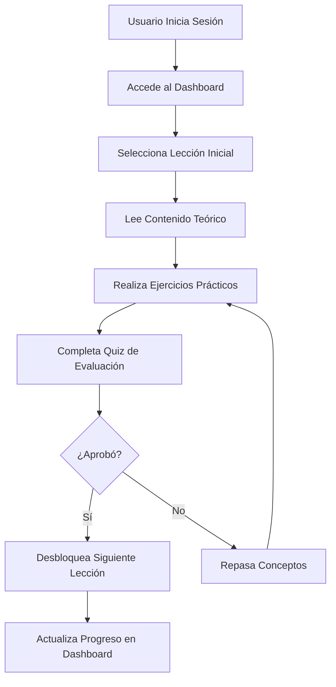
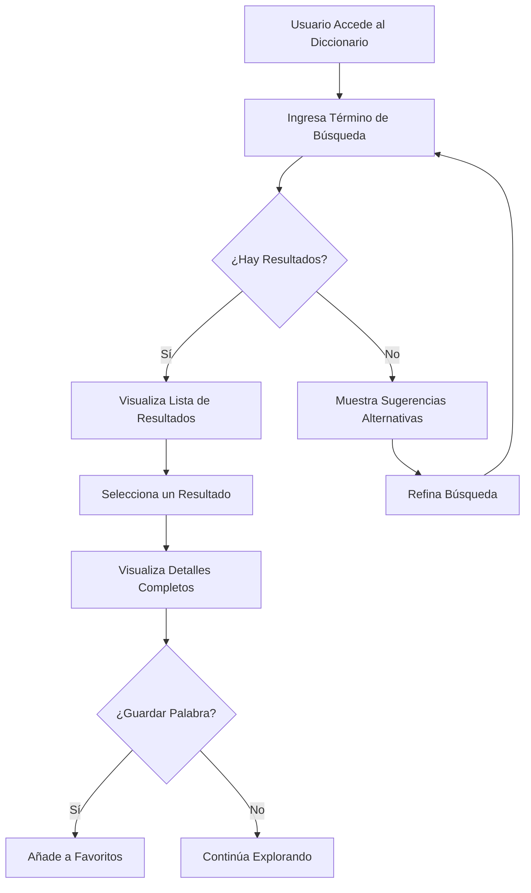
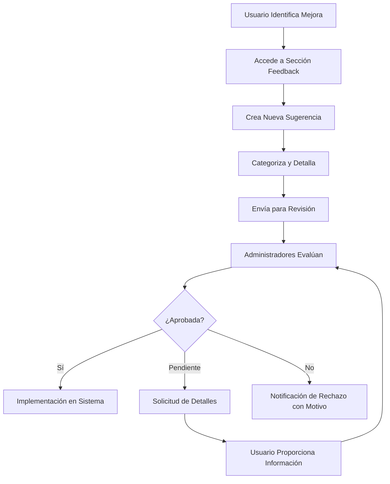
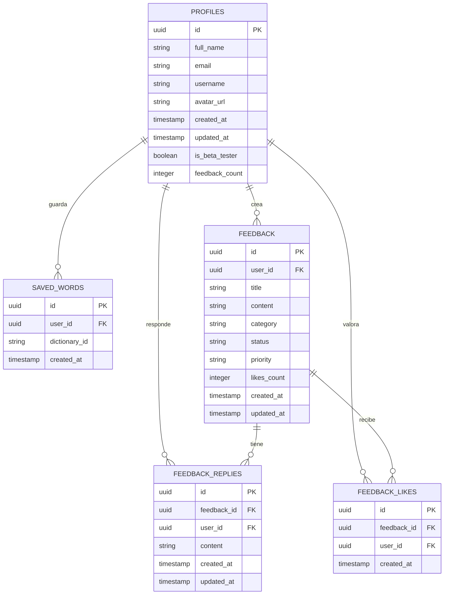

# Documentación General - Nawatlahtol (Aplicación de Aprendizaje de Náhuatl)

## 📋 Índice
1. [Visión General del Proyecto](#visión-general-del-proyecto)
2. [Arquitectura de la Solución](#arquitectura-de-la-solución)
3. [Estructura del Repositorio](#estructura-del-repositorio)
4. [Configuración del Entorno de Desarrollo](#configuración-del-entorno-de-desarrollo)
5. [Características Principales](#características-principales)
6. [Guías de Usuario](#guías-de-usuario)
7. [Flujos de Usuario](#flujos-de-usuario)
8. [Modelo de Datos](#modelo-de-datos)
9. [Integración Frontend-Backend](#integración-frontend-backend)
10. [Roadmap y Desarrollo Futuro](#roadmap-y-desarrollo-futuro)
11. [Contribución al Proyecto](#contribución-al-proyecto)
12. [Licencia y Atribuciones](#licencia-y-atribuciones)
13. [Preguntas Frecuentes](#preguntas-frecuentes)

---

## Visión General del Proyecto

### Misión

Nawatlahtol es una plataforma educativa interactiva diseñada para preservar, difundir y enseñar la lengua náhuatl utilizando tecnologías modernas. El proyecto busca conectar a hablantes, estudiantes y entusiastas para contribuir a la revitalización de esta importante lengua indígena de México.

### Objetivos

1. **Preservación Cultural**: Contribuir a la documentación y preservación del náhuatl como patrimonio cultural inmaterial
2. **Educación Accesible**: Proporcionar herramientas gratuitas para el aprendizaje del náhuatl
3. **Comunidad Activa**: Crear una red de aprendices y hablantes que colaboren en el enriquecimiento continuo de la plataforma
4. **Innovación Tecnológica**: Aplicar tecnologías modernas para métodos educativos efectivos

### Público Objetivo

- Estudiantes interesados en aprender náhuatl
- Personas con raíces culturales náhuatl que desean reconectar con su herencia
- Investigadores y lingüistas enfocados en lenguas indígenas
- Educadores que buscan recursos para enseñanza
- Entusiastas de la cultura y lenguas mesoamericanas

### Historia del Proyecto

Nawatlahtol nació como un proyecto de preservación cultural iniciado por José Ortega, con el objetivo de aplicar tecnologías modernas para difundir y revitalizar el náhuatl. Lo que comenzó como un diccionario digital evolucionó a una plataforma educativa completa que integra múltiples herramientas de aprendizaje y fomenta la creación de comunidad.

---

## Arquitectura de la Solución

### Visión General de la Arquitectura

Nawatlahtol sigue una arquitectura cliente-servidor moderna con una clara separación entre frontend y backend:

```
┌─────────────────┐       ┌─────────────────┐       ┌─────────────────┐
│                 │       │                 │       │                 │
│  FRONTEND       │       │  BACKEND        │       │  BASE DE DATOS  │
│  (Next.js)      │◄─────►│  (Express.js)   │◄─────►│  (Supabase)     │
│                 │       │                 │       │                 │
└─────────────────┘       └─────────────────┘       └─────────────────┘
        ▲                         ▲                         ▲
        │                         │                         │
        ▼                         ▼                         ▼
┌─────────────────┐       ┌─────────────────┐       ┌─────────────────┐
│                 │       │                 │       │                 │
│  USUARIOS       │       │  ARCHIVOS JSON  │       │  ALMACENAMIENTO │
│  (Navegador)    │       │  (Diccionario,  │       │  (Avatares,     │
│                 │       │   Lecciones)    │       │   Archivos)     │
└─────────────────┘       └─────────────────┘       └─────────────────┘
```

### Componentes Principales

1. **Frontend (Next.js)**:
   - Interfaz de usuario interactiva
  - Renderizado híbrido (SSR + CSR)
   - Rutas y navegación
   - Componentes reutilizables
   - Gestión de estado del cliente

2. **Backend (Express.js)**:
   - API RESTful
   - Lógica de negocio
   - Acceso a datos
   - Autenticación y autorización
   - Manejo de errores

3. **Base de Datos (Supabase)**:
   - Almacenamiento de datos de usuario
   - Sistema de autenticación
   - Relaciones entre entidades
   - Gestión de permisos
   - API en tiempo real (futura implementación)

4. **Archivos JSON**:
   - Diccionario Náhuatl-Español
   - Estructura de lecciones
   - Datos de práctica y ejercicios

### Diagrama de Flujo de Datos

```
┌────────────┐    1. Solicitud    ┌────────────┐    2. Procesamiento    ┌────────────┐
│            │───────────────────►│            │─────────────────────►  │            │
│  Cliente   │                    │  API       │                        │  Servicios │
│  (Browser) │◄───────────────────│  Express   │◄─────────────────────  │  (Lógica)  │
│            │    8. Respuesta    │            │    7. Resultado        │            │
└────────────┘                    └────────────┘                        └────────────┘
                                       ▲  │                                ▲  │
                                       │  │                                │  │
                                       │  │ 3. Consulta                    │  │ 5. Acceso
                                       │  ▼                                │  ▼
                                  ┌────────────┐                      ┌────────────┐
                                  │            │                      │            │
                                  │  Supabase  │◄─────────────────────│  Archivos  │
                                  │  Database  │                      │  JSON      │
                                  │            │─────────────────────►│            │
                                  └────────────┘                      └────────────┘
                                     4. Datos                           6. Datos
                                     de Usuario                         de Contenido
```

### Tecnologías Utilizadas

| Capa | Tecnologías | Propósito |
|------|-------------|-----------|
| **Frontend** | Next.js, React, TypeScript, Tailwind CSS, Framer Motion | Interfaz de usuario, renderizado, estilos, animaciones |
| **Backend** | Node.js, Express.js, Supabase SDK | API RESTful, lógica de negocio, acceso a datos |
| **Base de Datos** | PostgreSQL (vía Supabase) | Almacenamiento persistente de datos |
| **Despliegue** | Vercel (Frontend y Backend) | Hosting, CI/CD, escalabilidad |
| **Desarrollo** | Git, GitHub, VS Code | Control de versiones, colaboración, IDE |

---

## Estructura del Repositorio

El proyecto está organizado en un repositorio monolítico con dos carpetas principales: `frontend` y `backend`.

```
nahuatl-app/
├── BD.sql                      # Script SQL de la base de datos
├── dicc-zon.md                 # Documentación del diccionario
├── SUPABASE_SETUP.md           # Guía de configuración de Supabase
├── vercel.json                 # Configuración de despliegue en Vercel
├── backend/                    # API y servicios backend
│   ├── index.js                # Punto de entrada del servidor
│   ├── package.json            # Dependencias backend
│   ├── README.md               # Documentación del backend
│   └── data/                   # Datos JSON
│       ├── dictionary.json     # Diccionario Náhuatl-Español
│       ├── lecciones.json      # Lecciones en español
│       ├── lessons.json        # Lecciones en inglés
│       └── vocabulario.json    # Vocabulario por temas
├── frontend/                   # Aplicación cliente
│   ├── package.json            # Dependencias frontend
│   ├── next.config.ts          # Configuración de Next.js
│   ├── tailwind.config.js      # Configuración de Tailwind CSS
│   ├── tsconfig.json           # Configuración de TypeScript
│   ├── README.md               # Documentación del frontend
│   ├── public/                 # Archivos estáticos
│   ├── scripts/                # Scripts de utilidad
│   └── src/                    # Código fuente
│       ├── app/                # Páginas y rutas
│       ├── components/         # Componentes reutilizables
│       └── lib/                # Utilidades y configuraciones
```

### Estructura de Archivos Clave

#### Frontend (`frontend/src/`)

```
src/
├── app/                       # Páginas y rutas (Next.js App Router)
│   ├── layout.tsx             # Layout principal
│   ├── page.tsx               # Página de inicio
│   ├── diccionario/           # Página del diccionario
│   ├── dashboard/             # Dashboard del usuario
│   ├── login/                 # Autenticación
│   ├── profile/               # Perfil de usuario
│   ├── feedback/              # Sistema de comentarios
│   └── ...                    # Otras páginas
├── components/                # Componentes reutilizables
│   ├── Header.tsx             # Barra de navegación
│   ├── Footer.tsx             # Pie de página
│   ├── Quiz.tsx               # Componente de cuestionario
│   ├── AnimatedBackground.tsx # Fondo animado
│   └── ...                    # Otros componentes
└── lib/                       # Utilidades y configuración
    ├── supabaseClient.ts      # Cliente de Supabase
    └── database.types.ts      # Tipos de la base de datos
```

#### Backend (`backend/`)

```
backend/
├── index.js                   # Servidor Express y endpoints
├── data/                      # Datos estáticos
│   ├── dictionary.json        # Diccionario completo
│   ├── lessons.json           # Estructura de lecciones
│   └── ...                    # Otros archivos de datos
└── package.json               # Dependencias y scripts
```

---

## Configuración del Entorno de Desarrollo

### Requisitos Previos

- Node.js (v16 o superior)
- npm (v7 o superior)
- Git
- Cuenta en Supabase
- Editor de código (recomendado: VS Code)

### Configuración Inicial

1. **Clonar el repositorio**:
   ```bash
   git clone https://github.com/joseorteha/nahuatl-web.git
   cd nahuatl-web
   ```

2. **Configurar el frontend**:
   ```bash
   cd frontend
   npm install
   cp .env.example .env.local
   # Editar .env.local con tus credenciales de Supabase
   ```

3. **Configurar el backend**:
   ```bash
   cd ../backend
   npm install
   cp .env.example .env
   # Editar .env con tus credenciales de Supabase
   ```

4. **Configurar Supabase**:
   - Crear un nuevo proyecto en Supabase
   - Ejecutar los scripts SQL de `BD.sql` y `SUPABASE_SETUP.md`
   - Configurar las credenciales en los archivos .env

### Ejecución en Desarrollo

1. **Iniciar el backend**:
   ```bash
   cd backend
   npm run dev
   # El servidor estará disponible en http://localhost:3001
   ```

2. **Iniciar el frontend**:
   ```bash
   cd frontend
   npm run dev
   # La aplicación estará disponible en http://localhost:3000
   ```

### Variables de Entorno

#### Frontend (.env.local)
```
NEXT_PUBLIC_SUPABASE_URL=https://tu-proyecto.supabase.co
NEXT_PUBLIC_SUPABASE_ANON_KEY=tu-clave-publica
NEXT_PUBLIC_API_URL=http://localhost:3001
```

#### Backend (.env)
```
PORT=3001
SUPABASE_URL=https://tu-proyecto.supabase.co
SUPABASE_SERVICE_KEY=tu-clave-de-servicio
```

---

## Características Principales

### 1. Diccionario Interactivo

El diccionario náhuatl-español es el núcleo de la aplicación, ofreciendo:

- **Búsqueda Avanzada**: Sistema inteligente que pondera resultados por relevancia
- **Información Detallada**: Definiciones, ejemplos, notas culturales y etimología
- **Palabras Favoritas**: Capacidad de guardar términos para estudio posterior
- **Ejemplos Contextuales**: Oraciones de ejemplo con traducción

### 2. Sistema de Lecciones

Estructura educativa progresiva para aprender náhuatl:

- **Niveles Graduales**: Desde principiante hasta avanzado
- **Contenido Estructurado**: Gramática, vocabulario y ejercicios prácticos
- **Ejemplos Culturales**: Integración de elementos culturales en el aprendizaje
- **Quizzes Interactivos**: Evaluaciones para reforzar el aprendizaje

### 3. Sistema de Usuarios

Gestión completa de usuarios y perfiles:

- **Registro e Inicio de Sesión**: Sistema de autenticación completo
- **Perfiles Personalizados**: Información del usuario y preferencias
- **Seguimiento de Progreso**: Registro de lecciones completadas y palabras aprendidas
- **Dashboard Personalizado**: Vista centralizada del avance del usuario

### 4. Comunidad y Feedback

Herramientas para fomentar la participación comunitaria:

- **Sistema de Sugerencias**: Capacidad de enviar comentarios y propuestas
- **Votación de Feedback**: Valoración comunitaria de las sugerencias
- **Respuestas Oficiales**: Comunicación directa con los administradores
- **Foros Temáticos**: Espacios de discusión (en desarrollo)

### 5. Interfaz Bilingüe

Diseño que integra de forma natural náhuatl y español:

- **Navegación Dual**: Elementos de interfaz en ambos idiomas
- **Diseño Cultural**: Elementos visuales inspirados en la estética náhuatl
- **Accesibilidad**: Interfaz intuitiva adaptada a diferentes niveles de familiaridad

---

## Guías de Usuario

### Guía para Usuarios Nuevos

1. **Registro en la Plataforma**:
   - Acceder a la página de inicio
   - Hacer clic en "Acceder" en la esquina superior derecha
   - Seleccionar "¿No tienes cuenta? Regístrate"
   - Completar el formulario con nombre, email y contraseña
   - Confirmar registro

2. **Primera Exploración**:
   - Navegar al dashboard personal
   - Explorar las secciones principales: Diccionario, Lecciones, Comunidad
   - Visitar el perfil para completar información adicional

3. **Uso del Diccionario**:
   - Acceder a la sección "Diccionario"
   - Utilizar la barra de búsqueda para encontrar palabras
   - Explorar las definiciones, ejemplos y notas
   - Guardar palabras favoritas con el botón de marcador

4. **Comenzar Aprendizaje**:
   - Acceder a la sección "Lecciones"
   - Comenzar con la primera lección de nivel principiante
   - Completar los ejercicios interactivos
   - Realizar el quiz final para evaluar comprensión

### Guía para Contribuidores

1. **Enviar Feedback**:
   - Acceder a la sección "Feedback"
   - Hacer clic en "Nueva Sugerencia"
   - Seleccionar categoría (sugerencia, error, característica)
   - Escribir título y descripción detallada
   - Enviar para revisión

2. **Participar en Comunidad**:
   - Revisar sugerencias existentes
   - Votar en las más relevantes
   - Comentar en discusiones abiertas
   - Compartir recursos adicionales

3. **Proponer Mejoras al Diccionario**:
   - Identificar términos faltantes o incorrectos
   - Documentar con fuentes verificables
   - Enviar como sugerencia de tipo "Diccionario"
   - Incluir ejemplos de uso si es posible

---

## Flujos de Usuario

### Flujo de Aprendizaje Básico



### Flujo de Uso del Diccionario



### Flujo de Contribución y Feedback



---

## Modelo de Datos

### Diagrama Entidad-Relación



### Estructura JSON

#### Entrada de Diccionario
```json
{
  "id": "word123",
  "word": "cihuatl",
  "variants": ["sihuatl"],
  "grammar_info": "sustantivo",
  "definition": "mujer",
  "scientific_name": null,
  "examples": [
    {
      "nahuatl": "In cihuatl cualli tlacua",
      "espanol": "La mujer come bien"
    }
  ],
  "synonyms": ["soatl"],
  "roots": ["cih", "uatl"],
  "see_also": ["tecihuauh"],
  "alt_spellings": ["zihuatl"],
  "notes": ["Palabra fundamental en la estructura social náhuatl"]
}
```

#### Lección
```json
{
  "id": "lesson1",
  "slug": "saludos-y-presentaciones",
  "title": "Saludos y Presentaciones",
  "description": "Aprende a saludar y presentarte en náhuatl",
  "level": "beginner",
  "topics": ["saludos", "presentaciones", "frases básicas"],
  "content": {
    "sections": [
      {
        "title": "Introducción",
        "type": "text",
        "content": "En esta lección aprenderemos..."
      },
      {
        "title": "Saludos Formales",
        "type": "vocabulary",
        "content": "..."
      }
    ]
  },
  "quiz": {
    "questions": [
      {
        "question": "¿Cómo se dice 'buenos días' en náhuatl?",
        "options": ["Cualli tonalli", "Cualli yohualli", "Niltze", "Qualli mochihua"],
        "answer": "Cualli tonalli"
      }
    ]
  }
}
```

---

## Integración Frontend-Backend

### Comunicación API

El frontend se comunica con el backend a través de una API RESTful:

#### Ejemplo de Llamada API (Frontend)
```typescript
// Búsqueda en el diccionario
const fetchResults = async (query: string) => {
  if (query.trim().length < 2) {
    setResults([]);
    return;
  }
  setIsLoading(true);
  try {
    const apiUrl = process.env.NEXT_PUBLIC_API_URL || 'https://nahuatl-web.vercel.app';
    const response = await fetch(`${apiUrl}/api/dictionary/search?q=${encodeURIComponent(query)}`);
    if (!response.ok) throw new Error('La respuesta de la red no fue correcta');
    const data = await response.json();
    setResults(data);
  } catch (err) {
    console.error('Error al obtener datos del diccionario:', err);
    setError('Error al conectar con el diccionario. Inténtalo de nuevo más tarde.');
  } finally {
    setIsLoading(false);
  }
};
```

#### Endpoint Correspondiente (Backend)
```javascript
// Endpoint para buscar en el diccionario
app.get('/api/dictionary/search', (req, res) => {
  const query = req.query.q?.toLowerCase() || '';

  fs.readFile(dictionaryPath, 'utf8', (err, data) => {
    if (err) {
      console.error(err);
      return res.status(500).send('Error al leer los datos del diccionario.');
    }
    
    const dictionary = JSON.parse(data);
    
    if (!query) {
      return res.json(dictionary.slice(0, 20)); 
    }

    const lowerQuery = query.toLowerCase();
    const scoredResults = dictionary
      .map(entry => {
        let score = 0;
        // Algoritmo de puntuación...
        return { ...entry, score };
      })
      .filter(entry => entry.score > 0)
      .sort((a, b) => b.score - a.score);

    res.json(scoredResults);
  });
});
```

### Manejo de Estados

El frontend gestiona estados locales para una experiencia de usuario fluida:

```typescript
// Estados para la búsqueda en diccionario
const [searchTerm, setSearchTerm] = useState('');
const [results, setResults] = useState<DictionaryEntry[]>([]);
const [isLoading, setIsLoading] = useState(false);
const [error, setError] = useState<string | null>(null);
const [hasSearched, setHasSearched] = useState(false);
const [savedWords, setSavedWords] = useState<string[]>([]);
```

### Gestión de Autenticación

El flujo de autenticación entre frontend y backend:

1. **Frontend solicita login**:
   ```typescript
  const response = await fetch('https://nahuatl-web.vercel.app/api/login', {
     method: 'POST',
     headers: { 'Content-Type': 'application/json' },
     body: JSON.stringify({ emailOrUsername: email, password }),
   });
   ```

2. **Backend valida credenciales**:
   ```javascript
   app.post('/api/login', async (req, res) => {
     const { emailOrUsername, password } = req.body;
     // Validación y autenticación...
     if (user.password !== password) {
       return res.status(401).json({ error: 'Credenciales incorrectas.' });
     }
     const { password: _, ...userData } = user;
     res.json({ user: userData });
   });
   ```

3. **Frontend almacena sesión**:
   ```typescript
   localStorage.setItem('user', JSON.stringify(result.user));
   router.push('/dashboard');
   ```

---

## Roadmap y Desarrollo Futuro

### Mejoras Planificadas

#### Corto Plazo (1-3 meses)
- **Seguridad de Autenticación**: Implementar hashing de contraseñas y tokens JWT
- **Perfil de Usuario Mejorado**: Añadir estadísticas de aprendizaje y progreso
- **Optimización de Rendimiento**: Mejorar tiempos de carga y respuesta
- **Correcciones de UX/UI**: Resolver problemas de usabilidad identificados

#### Medio Plazo (3-6 meses)
- **Ampliación de Lecciones**: Añadir contenido para niveles intermedio y avanzado
- **Ejercicios Interactivos**: Implementar más tipos de actividades prácticas
- **Funcionalidades Sociales**: Seguimiento entre usuarios y compartir progreso
- **Audio y Pronunciación**: Añadir grabaciones de pronunciación nativa

#### Largo Plazo (6-12 meses)
- **App Móvil**: Desarrollo de aplicaciones nativas para iOS/Android
- **Modo Offline**: Funcionalidad sin conexión para áreas con internet limitado
- **Reconocimiento de Voz**: Práctica de pronunciación con feedback
- **Extensión a Otras Variantes**: Añadir otras variantes dialectales del náhuatl

### Experimentos y Prototipos

- **Integración con IA**: Asistente conversacional para práctica de diálogo
- **Realidad Aumentada**: Reconocimiento de objetos con etiquetas en náhuatl
- **Gamificación Avanzada**: Sistema de logros y competiciones amistosas
- **Colaboraciones Académicas**: Integración con instituciones educativas

---

## Contribución al Proyecto

### Guía para Contribuidores

1. **Preparación**:
   - Fork del repositorio
   - Clonar localmente
   - Configurar entorno de desarrollo

2. **Desarrollo**:
   - Crear rama para tu contribución (`feature/nombre-caracteristica`)
   - Implementar cambios siguiendo guías de estilo
   - Documentar adecuadamente
   - Escribir pruebas cuando sea aplicable

3. **Envío**:
   - Asegurar que todo funciona correctamente
   - Hacer commit con mensajes descriptivos
   - Push a tu fork
   - Crear Pull Request detallando cambios

### Áreas para Contribuir

- **Contenido Educativo**: Lecciones, ejemplos, información cultural
- **Diccionario**: Correcciones, adiciones, mejoras etimológicas
- **Frontend**: Mejoras de UX/UI, accesibilidad, componentes
- **Backend**: Optimización, seguridad, nuevos endpoints
- **Documentación**: Mejorar guías, tutoriales, ejemplos
- **Pruebas**: Ampliar cobertura, automatización

### Código de Conducta

Todos los contribuidores deben adherirse a estos principios:

- **Respeto**: Tratar a todos con cortesía y consideración
- **Inclusividad**: Valorar diversidad de perspectivas y experiencias
- **Colaboración**: Trabajar constructivamente con otros contribuidores
- **Integridad**: Ser transparente y ético en contribuciones
- **Enfoque Educativo**: Priorizar el valor pedagógico y cultural

---

## Licencia y Atribuciones

### Licencia del Proyecto

El proyecto Nawatlahtol está licenciado bajo [especificar licencia].

### Atribuciones

Este proyecto ha sido posible gracias a las siguientes contribuciones:

- **Datos Lingüísticos**: Basados en investigaciones académicas y colaboraciones con hablantes nativos
- **Bibliotecas Open Source**: Next.js, React, Express.js, Tailwind CSS, etc.
- **Recursos Culturales**: Adaptados con respeto a la tradición náhuatl
- **Comunidad**: Retroalimentación y mejoras sugeridas por usuarios

### Agradecimientos Especiales

- **Hablantes Nativos**: Por su invaluable ayuda en la verificación de contenido
- **Instituciones Colaboradoras**: [Listar si aplica]
- **Contribuidores Iniciales**: [Listar contribuidores principales]

---

## Preguntas Frecuentes

### General

**P: ¿Qué es Nawatlahtol?**  
R: Nawatlahtol es una plataforma educativa digital diseñada para aprender, preservar y difundir la lengua náhuatl mediante herramientas interactivas como diccionario, lecciones y ejercicios prácticos.

**P: ¿Es gratuita la plataforma?**  
R: Sí, la plataforma es completamente gratuita con el objetivo de hacer accesible el aprendizaje del náhuatl para todos.

**P: ¿Qué nivel de náhuatl puedo alcanzar?**  
R: La plataforma está diseñada para cubrir desde nivel principiante hasta avanzado, aunque actualmente estamos desarrollando más contenido para niveles superiores.

### Técnico

**P: ¿Funciona en dispositivos móviles?**  
R: Sí, la interfaz es responsiva y funciona bien en móviles, aunque planeamos desarrollar aplicaciones nativas para mejorar la experiencia.

**P: ¿Puedo usar la plataforma sin internet?**  
R: Actualmente se requiere conexión a internet, pero estamos trabajando en una funcionalidad offline para futuras versiones.

**P: ¿Cómo se protegen mis datos?**  
R: Utilizamos prácticas estándar de la industria para proteger la información de usuarios, y solo almacenamos los datos necesarios para el funcionamiento de la plataforma.

### Contenido

**P: ¿Qué variante del náhuatl se enseña?**  
R: Actualmente nos enfocamos en el náhuatl clásico y algunas variantes modernas principales, con planes de expandir a más variantes regionales.

**P: ¿Puedo contribuir con contenido?**  
R: ¡Absolutamente! Valoramos las contribuciones de la comunidad. Puedes enviar sugerencias a través de la sección de feedback o contactar directamente con el equipo.

**P: ¿Con qué frecuencia se actualiza el contenido?**  
R: Realizamos actualizaciones regulares mensuales, añadiendo nuevo contenido educativo y mejorando el existente basado en retroalimentación de usuarios.

---

*Documentación generada el 30 de agosto de 2025*

*Última actualización: 30 de agosto de 2025*
